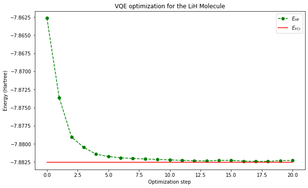

[](https://colab.research.google.com/github/QuCAI-Lab/qhack2022-hackeinberg-project/blob/dev/presentation.ipynb)

[](https://github.com/QuCAI-Lab/qhack2022-hackeinberg-project/blob/dev/LICENSE.md)

[](https://github.com/QuCAI-Lab/qhack2022-hackeinberg-project/graphs/commit-activity)
[](https://github.com/QuCAI-Lab/qhack2022-hackeinberg-project/actions/workflows/tests.yml)
[](https://github.com/QuCAI-Lab/qhack2022-hackeinberg-project/releases)

<div align="center">
  <a href="https://qucai-lab.github.io/"></a>
</div>

<div align="center">
  <h1> <a href="https://qhack.ai/events#hackathon-challenges"> QHack2022 Open Hackaton </a> - Hackeinberg Team Project </h1>
  <h2> Extending Adaptive Methods for Finding an Optimal Circuit Ansatze in VQE Optimization</h2>
</div>
<br>
<div align="center">
  <b>Developer: <a target="_blank" href="https://github.com/camponogaraviera">¹Lucas Camponogara Viera</a></b>
  <br>
  <b>Auditor: <a target="_blank" href="https://github.com/zemarchezi">²José Paulo Marchezi</a></b>
<br>
<b><a target="_blank" href="https://en.ntnu.edu.tw/">¹National Taiwan Normal University - NTNU, Taipei, Taiwan</a></b>.
<br>
<b><a target="_blank" href="https://www.gov.br/inpe/pt-br">²National Institute for Space Research - INPE, São José dos Campos, SP, Brazil.</a></b>.
<br>
<b><a target="_blank" href="http://english.nssc.cas.cn/">²State  Key  Laboratory  of  Space  Weather,  National  Space  Science  Center, Chinese  Academy  of  Sciences, China</a></b>.
</div>

<!--  -->

# Dependencies
<code>
<a href="https://www.python.org/">
<a href="https://numpy.org/">
<a href="https://matplotlib.org"> 
<a href="https://pennylane.ai/"></a>
<a href="https://qamuy.qunasys.com/docs/en/"></a>
</code>
<br>
<br>
  
For specific versions, see the [requirements.txt](requirements.txt) file.

# Preliminary Results

**Get the source code [here](https://github.com/QuCAI-Lab/qhack2022-hackeinberg-project/blob/dev/hackeinberg_project/main/simulation.py).**

Comparison with different approaches can be seen in the [jupyter notebook file](https://github.com/QuCAI-Lab/qhack2022-hackeinberg-project/blob/dev/presentation.ipynb).

<div align="center">
  <a href="https://raw.githubusercontent.com/QuCAI-Lab/qhack2022-hackeinberg-project/dev/assets/plot.png"></a>
</div>

# First Steps

To stay up-to-date with the latest version of the `hackeinberg-project`, we strongly recommend you to [fork this repository](https://github.com/QuCAI-Lab/qhack2022-hackeinberg-project/fork). If you would like to install the source code from scratch using your conda environment on-prem, please resort to the [Installation Instructions](https://github.com/QuCAI-Lab/qhack2022-hackeinberg-project/blob/dev/developers_guide.md#Installation) heading in the [**Developer's Guide**](developers_guide.md).

```bash
cd <gitclone_directory> && conda env create -n <env_name> environment.yml
conda activate <env_name> && python -m pip install --no-deps -v -e .
conda list hackeinberg-project
```
**Quick test-drive:**
```bash
>>> python hackeinberg_project/main/simulation.py
```
**Alternatively, run the package:**
```bash
$ python
```
```python
>>> import hackeinberg_project as hack
>>> hack.about()
>>> energy, sets, angles, n = hack.penny_simulation(params, H, HF, sets, qubits, conv_tol=1e-04, threshold=1.0e-5)
```

# Project Description:

Most widely considered hardware-efficient and Chemistry-inspired ansatze, although generic, suffer from either barren plateaus [[1](https://www.nature.com/articles/s41467-018-07090-4)] or inconsistency under low-order trotterization steps [[2](https://pubs.acs.org/doi/abs/10.1021/acs.jctc.9b01083)], respectively. To circumvent this drawback, different algorithms for optimization of variational quantum circuits (VQA), the so-called adaptive circuits, have already been proposed in the literature [[4](https://pennylane.ai/qml/demos/tutorial_adaptive_circuits.html)]. One example is the Adaptive Derivative-Assembled Pseudo-Trotter ansatz Variational Quantum Eigensolver (ADAPT-VQE) [[3](https://www.nature.com/articles/s41467-019-10988-2)]. In a nutshell, the ADAPT-VQE approach is to grow the ansatz by adding fermionic operators one-at-a-time so to preserve the amount of correlation energy. This approach can also be regarded as a particular optimization procedure for Full Configuration Interaction (FCI) VQE.

In this work, we combine some of the existing methods applied to the hybrid quantum-classical VQE [[5](https://doi.org/10.1038/ncomms5213)] algorithm for the particular case of the ground state of the LiH molecule. We prioritize the minimization of the circuit depth (the longest sequence of gates acting on a qubit register) at the cost of increasing parameter count (the number of parameters to be optimized) given the tradeoff between difficulty in implementation on NISQ devices vs difficulty in optimization on classical computers, respectively. The baseline approach took into consideration the following features for a good ansatz:

1. Coherence friendly: the circuit must be shallow, i.e, have a small number of layers in order to be computed during a time window smaller than the decoherence time.
2. Hardware friendly (qubit routing): gate coupling allowed only between nearest-neighbor qubits to avoid SWAP gates during qubit routing (mapping from the circuit diagram to a hardware topology).
3. Small number of hyperparameters: we seek the minimum amount of angles to be optimized in order to avoid classical optimization overhead (when classical computation becomes too expensive).

In the early stages of the project, the goal is to find a quasi-optimal ansatz by restricting the VQE simulation to single and double order excitations only. For the future, the plan is to frame the problem as a deep reinforcement learning approach to learn an optimal circuit ansatz considering higher excitation orders and the [Qamuy SDK](https://qamuy.qunasys.com/docs/en/).

## Algorithm Outline

1. With the spin orbitals of the molecule of interest, compute its second-quantized electronic Hamiltonian in the STO-3G basis.

2. Map the fermionic Hamiltonian given in terms of its fermionic operators into a spin qubit-equivalent Hamiltonian using either Bravyi-Kitaev or the inverted Jordan–Wigner transformation. This is required to perform gate-based quantum computation. The Hamiltonian will be used to compute the cost function that evaluates the expectation value of the Hamiltonian, while the number of qubits is required to obtain the electronic excitations and to set up the quantum circuit.

3. Obtain the single and double electronic excitations by acting with the electron annihilation and creation operators on the Hartree-Fock reference state.

4. Define a set with all unique single and double excitations to create the correspondent SO(2) unitary qubit gates (the particular Givens rotations) to each electronic excitation operator in order to build a quantum circuit ansatz of particle-conserving unitary qubit gates.

5. Initialize the qubit state to a reference Hartree-Fock state.

6. Initialize the parameter values of each gate in the ansatz to zero, i.e, initialize the ansatz to the identity matrix in order to compute the gradients with respect to the Hartree-Fock state.

7. Prepare the trial estate with the current ansatz.

8. Define the cost function as the expectation value of the qubit Hamiltonian. Define an optimizer (e.g. SGD).

9. Use the parameter shift rule to compute the gradient of the cost function with respect to its tunable parameters.

10. Identify the operators (gates) with the maximum and minimum gradient in magnitude. Add to the ansatz the gate whose gradient is at maximum magnitude. Remove from the set the gate with the gradient at minimum magnitude if it is smaller than a predefined threshold. Here, we add one gate per iteration while deleting a single gate if it satisfies the above condition.

11. Use the optimizer to update the circuit parameters according to a VQE experiment.

12. Define convergence as the difference between the ground truth and the expected value for the current optimization step. If the convergence tolerance is less than or equal to a pre-defined threshold $\epsilon$, exit the optimization loop and evaluate the cost metric of the final optimized circuit by measuring its circuit depth.

13. Repeat step 9.

# Challenges

- [Quantum Chemistry Challenge](https://github.com/XanaduAI/QHack/blob/master/Open_Hackathon.md#quantum-chemistry-challenge).

# References

\[1] McClean, J.R., Boixo, S., Smelyanskiy, V.N. et al. Barren plateaus in quantum neural network training landscapes. [Nat Commun 9, 4812 (2018)](https://www.nature.com/articles/s41467-018-07090-4). 

\[2] Grimsley, H. R.; Claudino, D.; Economou, S. E.; Barnes, E.; Mayhall, N. J. Is the trotterized uccsd ansatz chemically well-defined? [J. Chem. Theory Comput. 2020, 16, 1](https://pubs.acs.org/doi/abs/10.1021/acs.jctc.9b01083).

[3] Harper R. Grimsley, Sophia E. Economou, Edwin Barnes, Nicholas J. Mayhall, “An adaptive variational algorithm for exact molecular simulations on a quantum computer”. [Nat. Commun. 2019, 10, 3007](https://www.nature.com/articles/s41467-019-10988-2).

[4] PennyLane dev team, "Adaptive circuits for quantum chemistry". [PennyLane, 13 September 2021](https://pennylane.ai/qml/demos/tutorial_adaptive_circuits.html).

[5] Peruzzo, A., McClean, J., Shadbolt, P. et al. A variational eigenvalue solver on a photonic quantum processor. [Nat Commun 5, 4213 (2014)](https://doi.org/10.1038/ncomms5213).
  
# How to Contribute

If you would like to venture off the beaten path and contribute to the `hackeinberg-project` python package as a developer, kindly resort to the [Contribution Guidelines](https://github.com/QuCAI-Lab/qhack2022-hackeinberg-project/blob/dev/developers_guide.md#Contribution) to know more about the current CI/CD pipeline and the how to's for a good bug report/pull request.

# Members

- Theory and implementation: conceived and developed by [Lucas Camponogara Viera](https://github.com/camponogaraviera). 
- Auditor: code audited by [José Paulo Marchezi](https://github.com/zemarchezi) who has an interest in quantum computing and quantum machine learning.

# License

This work is licensed under a [Creative Commons Zero v1.0 Universal](LICENSE.md) license.

<hr>

Created and maintained by [@camponogaraviera][1].

[1]: https://github.com/camponogaraviera
[2]: https://github.com/zemarchezi
